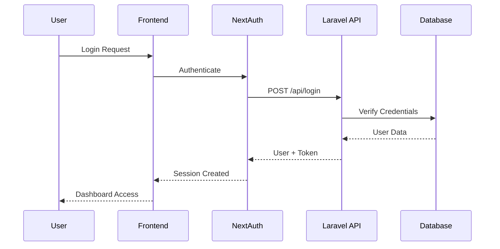
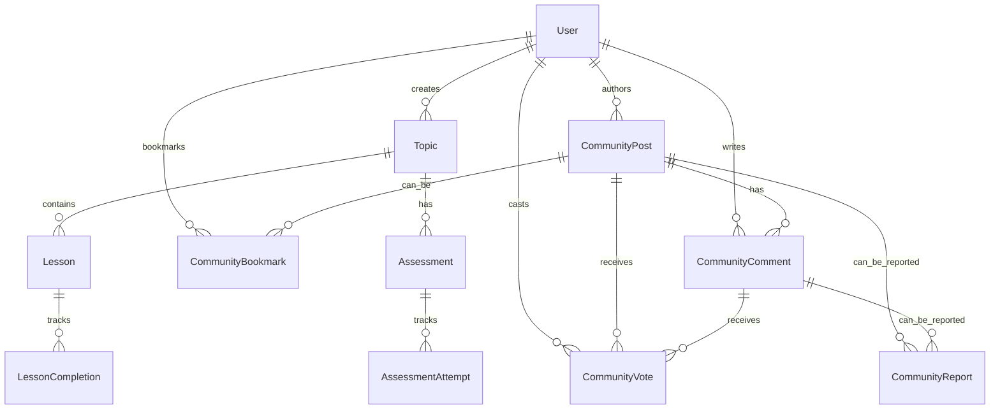

# 🏗️ LMS System Architecture Overview

> **Modern full-stack Learning Management System built with Next.js 15 & Laravel 11**

## 📊 Current System Overview

### Technology Stack
- **Frontend**: Next.js 15 with React 19, TypeScript, Tailwind CSS
- **Backend**: Laravel 11 with PHP 8.1+
- **Database**: SQLite (development) / MySQL/PostgreSQL (production)
- **Authentication**: Laravel Sanctum + NextAuth.js
- **Authorization**: Spatie Laravel Permission (RBAC)
- **UI Framework**: shadcn/ui + Radix UI
- **State Management**: React hooks + API client

### 🚧 Beta Components in Development

The following architectural components are currently in beta status:

**Advanced CMS Architecture (Beta)**
- Admin dashboard management system
- User analytics processing pipeline
- Content management workflow automation
- Real-time dashboard customization engine

**Enhanced Analytics Pipeline (Beta)**  
- Gamification data tracking system
- Achievement calculation algorithms
- Progress visualization rendering engine
- Advanced metrics aggregation services

> **Note**: Beta components are functional but undergoing active development for performance optimization and feature enhancement.

## 🎯 System Architecture

```mermaid
graph TB
    subgraph "Frontend (Next.js 15)"
        A[Browser] --> B[Next.js App Router]
        B --> C[NextAuth.js]
        B --> D[React Components]
        B --> E[Tailwind CSS + shadcn/ui]
        D --> F[API Client (Axios)]
    end
    
    subgraph "Backend (Laravel 11)"
        F --> G[Laravel Sanctum]
        G --> H[API Controllers]
        H --> I[Eloquent Models]
        H --> J[Spatie Permissions]
        I --> K[Database]
    end
    
    subgraph "Features"
        L[Topic Management]
        M[Assessment System]
        N[Community Forum]
        O[User Management]
        P[Analytics Dashboard]
    end
    
    H --> L
    H --> M
    H --> N
    H --> O
    H --> P
```

## 🏛️ Architectural Principles

### 1. **Separation of Concerns**
- **Frontend**: User interface, user experience, client-side logic
- **Backend**: Business logic, data management, API endpoints
- **Database**: Data persistence, relationships, constraints

### 2. **API-First Design**
- RESTful API with consistent endpoints
- JSON responses with standardized formats
- Proper HTTP status codes and error handling
- Comprehensive API documentation

### 3. **Security by Design**
- Token-based authentication (Laravel Sanctum)
- CSRF protection for web requests
- Role-based access control (RBAC)
- Input validation and sanitization
- Secure password hashing

### 4. **Scalable Architecture**
- Stateless API design
- Database relationship optimization
- Efficient caching strategies
- Background job processing capabilities
- Modular component structure

## 📁 Project Structure

```
lms-system/
├── 📱 Frontend (Next.js)
│   ├── app/                     # App Router (Next.js 15)
│   │   ├── (auth)/             # Authentication routes
│   │   ├── dashboard/          # Protected dashboard
│   │   │   ├── community/      # Forum functionality
│   │   │   ├── manage-topics/  # Content management
│   │   │   ├── reports/        # Analytics & reporting
│   │   │   └── user-management/ # Admin panel
│   │   └── api/auth/           # NextAuth API routes
│   ├── components/             # Reusable UI components
│   │   ├── ui/                 # shadcn/ui components
│   │   └── dashboard-*         # Feature-specific components
│   ├── lib/                    # Utilities and services
│   │   ├── api-client.ts       # Axios configuration
│   │   ├── services/           # API service layers
│   │   └── data-store.ts       # Client state management
│   └── hooks/                  # Custom React hooks
│
├── 🛠️ Backend (Laravel)
│   ├── app/
│   │   ├── Http/Controllers/Api/ # API controllers
│   │   │   ├── AuthController.php
│   │   │   ├── UserController.php
│   │   │   ├── TopicController.php
│   │   │   ├── LessonController.php
│   │   │   ├── AssessmentController.php
│   │   │   └── CommunityController.php
│   │   └── Models/             # Eloquent models
│   │       ├── User.php
│   │       ├── Topic.php
│   │       ├── Lesson.php
│   │       ├── Assessment.php
│   │       ├── CommunityPost.php
│   │       ├── CommunityComment.php
│   │       ├── CommunityVote.php
│   │       ├── CommunityBookmark.php
│   │       └── CommunityReport.php
│   ├── database/
│   │   ├── migrations/         # Database schema
│   │   ├── seeders/           # Test data
│   │   └── factories/         # Model factories
│   └── routes/api.php         # API route definitions
│
└── 📚 Documentation
    ├── README.md              # Main project documentation
    ├── SETUP_GUIDE.md         # Setup and troubleshooting
    ├── CROSS_PC_TROUBLESHOOTING.md
    ├── LARAVEL_BACKEND_SETUP.md
    └── NEXTJS_LARAVEL_INTEGRATION.md
```

## 🔐 Authentication & Authorization

### Authentication Flow


### Role-Based Access Control (RBAC)

| Role | Permissions | Features |
|------|-------------|----------|
| 👑 **Admin** | • Full system access<br>• User management<br>• Content moderation<br>• System reports | • Manage all users<br>• View all analytics<br>• Moderate community<br>• System configuration |
| 👨‍🏫 **Teacher** | • Content creation<br>• Topic management<br>• Assessment creation<br>• Student progress | • Create/edit topics<br>• Manage lessons<br>• Create assessments<br>• View class analytics |
| 👨‍🎓 **Student** | • Learning access<br>• Community participation<br>• Progress tracking<br>• Profile management | • Take courses<br>• Participate in forum<br>• Track progress<br>• Bookmark content |

## 📡 API Architecture

### RESTful API Design
```
GET    /api/users           # List users (admin)
POST   /api/users           # Create user (admin)
GET    /api/users/{id}      # Show user
PUT    /api/users/{id}      # Update user
DELETE /api/users/{id}      # Delete user (admin)

GET    /api/topics          # List topics
POST   /api/topics          # Create topic (teacher/admin)
GET    /api/topics/{id}     # Show topic
PUT    /api/topics/{id}     # Update topic (teacher/admin)
DELETE /api/topics/{id}     # Delete topic (admin)

GET    /api/community/posts     # List forum posts
POST   /api/community/posts     # Create post
GET    /api/community/posts/{id} # Show post with comments
POST   /api/community/vote      # Vote on content
POST   /api/community/report    # Report content
```

### Response Format
```json
{
  "success": true,
  "data": {
    "id": 1,
    "name": "Introduction to React",
    "description": "Learn React fundamentals"
  },
  "meta": {
    "current_page": 1,
    "total": 50,
    "per_page": 20
  }
}
```

## 💾 Database Design

### Key Models & Relationships



### Database Tables

**Core Tables:**
- `users` - User accounts and profiles
- `roles` - User roles (admin, teacher, student)
- `permissions` - Granular permissions
- `model_has_roles` - User-role assignments

**Learning Content:**
- `topics` - Course topics/modules
- `lessons` - Individual lessons
- `assessments` - Quizzes and tests
- `questions` - Assessment questions
- `lesson_completions` - Progress tracking
- `assessment_attempts` - Test results

**Community Features:**
- `community_posts` - Forum posts
- `community_comments` - Post comments
- `community_votes` - Upvotes/downvotes
- `community_bookmarks` - Saved posts
- `community_reports` - Content moderation

## 🔧 Development Workflow

### 1. Backend Development (Laravel)
```bash
# Create new feature
php artisan make:model FeatureName -mcr
php artisan make:migration create_feature_table
php artisan migrate

# Create API endpoint
php artisan make:controller Api/FeatureController --api

# Test the API
php artisan test --filter FeatureTest
```

### 2. Frontend Development (Next.js)
```bash
# Create API service
# lib/services/feature.service.ts

# Create React component
# components/feature-component.tsx

# Add to dashboard
# app/dashboard/feature/page.tsx
```

### 3. Integration Testing
```bash
# Backend tests
cd laravel-backend && php artisan test

# Frontend tests
npm run test

# E2E testing
npm run e2e
```

## 🚀 Performance Optimizations

### Backend Optimizations
- **Database Indexing**: Optimized queries with proper indexes
- **Eager Loading**: Reduce N+1 queries with relationships
- **Caching**: Permission caching, query result caching
- **Queue Jobs**: Background processing for heavy tasks

### Frontend Optimizations
- **Code Splitting**: Dynamic imports for large components
- **Image Optimization**: Next.js automatic image optimization
- **API Caching**: Efficient data fetching with SWR patterns
- **Bundle Analysis**: Regular bundle size monitoring

## 🔒 Security Features

### Data Protection
- **Input Validation**: Server-side validation for all inputs
- **SQL Injection Prevention**: Eloquent ORM protection
- **XSS Protection**: Output encoding and CSP headers
- **CSRF Protection**: Laravel Sanctum CSRF tokens

### Authentication Security
- **Token Management**: Secure token generation and rotation
- **Password Security**: bcrypt hashing with salt
- **Session Security**: Secure session configuration
- **Rate Limiting**: API request throttling

## 📈 Monitoring & Analytics

### Application Monitoring
- **Error Tracking**: Comprehensive error logging
- **Performance Monitoring**: API response time tracking
- **User Analytics**: Learning progress and engagement metrics
- **System Health**: Database and server monitoring

### Business Analytics
- **Learning Analytics**: Course completion rates, time spent
- **Community Analytics**: Post engagement, user participation
- **User Analytics**: Registration trends, activity patterns
- **Content Analytics**: Popular topics, assessment performance

## 🌍 Deployment Architecture

### Development Environment
```
Frontend: http://localhost:3000
Backend:  http://localhost:8000
Database: SQLite (local file)
```

### Production Environment
```
Frontend: Vercel/Netlify (CDN)
Backend:  Laravel Forge/AWS
Database: MySQL/PostgreSQL (managed)
Cache:    Redis (sessions, permissions)
Storage:  AWS S3 (file uploads)
```

## 🔄 Future Enhancements

### Planned Features
- **Real-time Features**: WebSocket integration for live discussions
- **Mobile App**: React Native companion app
- **Advanced Analytics**: Machine learning insights
- **Content Creation Tools**: Rich media editor, video processing
- **Integration APIs**: Third-party LMS integration

### Scalability Improvements
- **Microservices**: Service decomposition for large scale
- **CDN Integration**: Global content delivery
- **Database Sharding**: Horizontal scaling strategies
- **API Gateway**: Centralized API management

---

## 📋 Architecture Benefits

✅ **Maintainable**: Clear separation of concerns, modular design  
✅ **Scalable**: Stateless API, efficient database design  
✅ **Secure**: Multi-layer security, industry best practices  
✅ **Testable**: Comprehensive testing strategies  
✅ **Performant**: Optimized queries, efficient caching  
✅ **Developer-Friendly**: Modern tooling, clear documentation  

This architecture provides a solid foundation for a production-ready Learning Management System that can scale with growing user demands while maintaining security and performance standards.