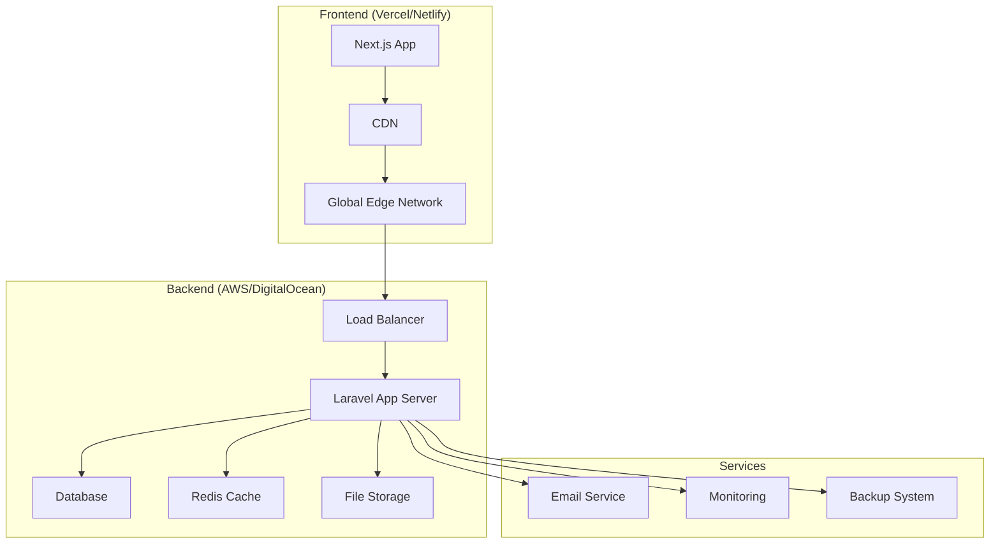

# 🚀 LMS System Deployment Guide

> **Complete guide for deploying the Learning Management System to production**

## 🌍 Deployment Overview

This guide covers deploying the LMS system using modern cloud platforms with recommended configurations for scalability, security, and performance.

### Recommended Architecture



## 📋 Pre-Deployment Checklist

### Environment Preparation
- [ ] Domain name registered and DNS configured
- [ ] SSL certificates obtained
- [ ] Cloud accounts set up (Vercel, AWS, DigitalOcean, etc.)
- [ ] Database hosting prepared (managed MySQL/PostgreSQL)
- [ ] Email service configured (SendGrid, Mailgun, etc.)
- [ ] File storage configured (AWS S3, DigitalOcean Spaces)

### Code Preparation
- [ ] All environment variables documented
- [ ] Database migrations tested
- [ ] Production builds tested locally
- [ ] Security audit completed
- [ ] Performance optimization verified

## 🎯 Frontend Deployment (Next.js)

### Option 1: Vercel (Recommended)

**1. Vercel Setup**
```bash
# Install Vercel CLI
npm i -g vercel

# Login to Vercel
vercel login

# Deploy from project root
vercel --prod
```

**2. Environment Variables in Vercel**
```bash
# Add via Vercel dashboard or CLI
vercel env add NEXT_PUBLIC_API_URL
vercel env add NEXTAUTH_URL
vercel env add NEXTAUTH_SECRET
```

**Production Environment Variables:**
```env
NEXT_PUBLIC_API_URL=https://api.yourdomain.com
NEXTAUTH_URL=https://yourdomain.com
NEXTAUTH_SECRET=your-super-secure-production-secret
NEXT_PUBLIC_APP_NAME=Your LMS Name
NODE_ENV=production
```

**3. Custom Domain Configuration**
```bash
# Add domain in Vercel dashboard
# Configure DNS:
# CNAME: www -> cname.vercel-dns.com
# A: @ -> 76.76.19.61
```

### Option 2: Netlify

**1. Build Configuration (`netlify.toml`)**
```toml
[build]
  command = "npm run build"
  publish = ".next"

[build.environment]
  NODE_VERSION = "18"

[[redirects]]
  from = "/api/*"
  to = "https://api.yourdomain.com/api/:splat"
  status = 200
  force = true

[[headers]]
  for = "/*"
  [headers.values]
    X-Frame-Options = "DENY"
    X-XSS-Protection = "1; mode=block"
    X-Content-Type-Options = "nosniff"
```

**2. Environment Variables**
Set in Netlify dashboard:
- `NEXT_PUBLIC_API_URL`
- `NEXTAUTH_URL`
- `NEXTAUTH_SECRET`

### Option 3: Self-Hosted

**1. Docker Configuration**
```dockerfile
# Dockerfile
FROM node:18-alpine AS deps
WORKDIR /app
COPY package*.json ./
RUN npm ci --only=production

FROM node:18-alpine AS builder
WORKDIR /app
COPY . .
COPY --from=deps /app/node_modules ./node_modules
RUN npm run build

FROM node:18-alpine AS runner
WORKDIR /app
ENV NODE_ENV production

RUN addgroup -g 1001 -S nodejs
RUN adduser -S nextjs -u 1001

COPY --from=builder /app/public ./public
COPY --from=builder --chown=nextjs:nodejs /app/.next ./.next
COPY --from=builder /app/node_modules ./node_modules
COPY --from=builder /app/package.json ./package.json

USER nextjs

EXPOSE 3000

CMD ["npm", "start"]
```

**2. Docker Compose**
```yaml
version: '3.8'
services:
  frontend:
    build: .
    ports:
      - "3000:3000"
    environment:
      - NEXT_PUBLIC_API_URL=https://api.yourdomain.com
      - NEXTAUTH_URL=https://yourdomain.com
      - NEXTAUTH_SECRET=${NEXTAUTH_SECRET}
    restart: unless-stopped
```

## 🛠️ Backend Deployment (Laravel)

### Option 1: Laravel Forge (Recommended)

**1. Server Setup**
- Choose DigitalOcean, AWS, or Linode
- Select PHP 8.1+, MySQL 8.0+, Nginx
- Configure SSL (Let's Encrypt)

**2. Site Configuration**
```bash
# Repository: your-username/lms-system
# Branch: main
# Root Directory: /laravel-backend
```

**3. Environment Variables**
```env
APP_NAME="LMS System"
APP_ENV=production
APP_KEY=base64:your-generated-app-key
APP_DEBUG=false
APP_URL=https://api.yourdomain.com

DB_CONNECTION=mysql
DB_HOST=your-db-host
DB_PORT=3306
DB_DATABASE=lms_production
DB_USERNAME=your-db-user
DB_PASSWORD=your-secure-password

SANCTUM_STATEFUL_DOMAINS=yourdomain.com,www.yourdomain.com
SESSION_DOMAIN=.yourdomain.com
SESSION_SECURE_COOKIE=true

FRONTEND_URL=https://yourdomain.com

MAIL_MAILER=smtp
MAIL_HOST=smtp.sendgrid.net
MAIL_PORT=587
MAIL_USERNAME=apikey
MAIL_PASSWORD=your-sendgrid-api-key
MAIL_ENCRYPTION=tls
MAIL_FROM_ADDRESS=noreply@yourdomain.com
MAIL_FROM_NAME="${APP_NAME}"

FILESYSTEM_DISK=s3
AWS_ACCESS_KEY_ID=your-access-key
AWS_SECRET_ACCESS_KEY=your-secret-key
AWS_DEFAULT_REGION=us-east-1
AWS_BUCKET=your-bucket-name

REDIS_HOST=127.0.0.1
REDIS_PASSWORD=null
REDIS_PORT=6379

LOG_CHANNEL=stack
LOG_LEVEL=error
```

**4. Deployment Script**
```bash
cd /home/forge/api.yourdomain.com/laravel-backend

git pull origin main
composer install --no-dev --optimize-autoloader
php artisan config:cache
php artisan route:cache
php artisan view:cache
php artisan migrate --force
php artisan queue:restart

# Reload PHP-FPM
sudo supervisorctl restart all
```

### Option 2: DigitalOcean App Platform

**1. App Configuration (`app.yaml`)**
```yaml
name: lms-backend
services:
- name: api
  source_dir: /laravel-backend
  github:
    repo: your-username/lms-system
    branch: main
  run_command: php artisan serve --host=0.0.0.0 --port=8080
  environment_slug: php
  instance_count: 1
  instance_size_slug: basic-xxs
  routes:
  - path: /
  envs:
  - key: APP_ENV
    value: production
  - key: APP_KEY
    value: your-app-key
    type: SECRET
databases:
- name: lms-db
  engine: mysql
  version: "8"
```

### Option 3: AWS Elastic Beanstalk

**1. Configuration (`.ebextensions/laravel.config`)**
```yaml
option_settings:
  aws:elasticbeanstalk:container:php:phpini:
    document_root: /public
    memory_limit: 512M
    max_execution_time: 60
  aws:elasticbeanstalk:application:environment:
    APP_ENV: production
    APP_DEBUG: false
    APP_KEY: your-app-key

container_commands:
  01_composer_install:
    command: "composer install --no-dev --optimize-autoloader"
  02_artisan_migrate:
    command: "php artisan migrate --force"
  03_artisan_cache:
    command: "php artisan config:cache && php artisan route:cache"
```

## 🗄️ Database Setup

### Managed Database (Recommended)

**AWS RDS:**
```bash
# Create MySQL 8.0 instance
# Configure security groups
# Set up automated backups
# Enable Multi-AZ for high availability
```

**DigitalOcean Managed Database:**
```bash
# Create MySQL cluster
# Configure firewall rules
# Set up automated backups
# Configure read replicas if needed
```

### Database Migration
```bash
# Export from development
mysqldump -u user -p lms_system > lms_backup.sql

# Import to production
mysql -u prod_user -p lms_production < lms_backup.sql

# Run Laravel migrations
php artisan migrate --force
```

## 📧 Email Service Configuration

### SendGrid Setup
```env
MAIL_MAILER=smtp
MAIL_HOST=smtp.sendgrid.net
MAIL_PORT=587
MAIL_USERNAME=apikey
MAIL_PASSWORD=your-sendgrid-api-key
MAIL_ENCRYPTION=tls
```

### Mailgun Setup
```env
MAIL_MAILER=mailgun
MAILGUN_DOMAIN=yourdomain.com
MAILGUN_SECRET=your-mailgun-key
MAILGUN_ENDPOINT=api.mailgun.net
```

## 💾 File Storage Configuration

### AWS S3 Setup
```env
FILESYSTEM_DISK=s3
AWS_ACCESS_KEY_ID=your-access-key
AWS_SECRET_ACCESS_KEY=your-secret-key
AWS_DEFAULT_REGION=us-east-1
AWS_BUCKET=lms-production-files
AWS_USE_PATH_STYLE_ENDPOINT=false
```

**S3 Bucket Policy:**
```json
{
  "Version": "2012-10-17",
  "Statement": [
    {
      "Sid": "PublicReadGetObject",
      "Effect": "Allow",
      "Principal": "*",
      "Action": "s3:GetObject",
      "Resource": "arn:aws:s3:::lms-production-files/public/*"
    }
  ]
}
```

### DigitalOcean Spaces
```env
FILESYSTEM_DISK=s3
AWS_ACCESS_KEY_ID=your-spaces-key
AWS_SECRET_ACCESS_KEY=your-spaces-secret
AWS_DEFAULT_REGION=nyc3
AWS_BUCKET=lms-files
AWS_ENDPOINT=https://nyc3.digitaloceanspaces.com
```

## 🔐 Security Configuration

### SSL/TLS Setup
```nginx
# Nginx configuration
server {
    listen 443 ssl http2;
    server_name api.yourdomain.com;
    
    ssl_certificate /path/to/certificate.crt;
    ssl_certificate_key /path/to/private.key;
    
    ssl_protocols TLSv1.2 TLSv1.3;
    ssl_ciphers ECDHE-RSA-AES256-GCM-SHA512:DHE-RSA-AES256-GCM-SHA512;
    ssl_prefer_server_ciphers off;
    
    # Security headers
    add_header X-Frame-Options "SAMEORIGIN" always;
    add_header X-XSS-Protection "1; mode=block" always;
    add_header X-Content-Type-Options "nosniff" always;
    add_header Referrer-Policy "no-referrer-when-downgrade" always;
    add_header Content-Security-Policy "default-src 'self'" always;
    
    root /home/forge/api.yourdomain.com/laravel-backend/public;
    index index.php;
    
    location / {
        try_files $uri $uri/ /index.php?$query_string;
    }
    
    location ~ \.php$ {
        fastcgi_pass unix:/var/run/php/php8.1-fpm.sock;
        fastcgi_param SCRIPT_FILENAME $realpath_root$fastcgi_script_name;
        include fastcgi_params;
    }
}
```

### Firewall Configuration
```bash
# Allow only necessary ports
sudo ufw allow 22   # SSH
sudo ufw allow 80   # HTTP
sudo ufw allow 443  # HTTPS
sudo ufw enable
```

## 📊 Monitoring & Analytics

### Application Monitoring

**Laravel Telescope (Development/Staging):**
```bash
composer require laravel/telescope --dev
php artisan telescope:install
php artisan migrate
```

**Production Monitoring (Sentry):**
```bash
composer require sentry/sentry-laravel
```

```env
SENTRY_LARAVEL_DSN=your-sentry-dsn
SENTRY_TRACES_SAMPLE_RATE=0.2
```

### Server Monitoring

**Basic Health Check Script:**
```bash
#!/bin/bash
# health-check.sh

# Check web server
curl -f http://localhost || exit 1

# Check database
php artisan tinker --execute="DB::connection()->getPdo();" || exit 1

# Check Redis
redis-cli ping || exit 1

echo "All services healthy"
```

**Cron Job Setup:**
```bash
# Add to crontab
*/5 * * * * /path/to/health-check.sh
```

## 🔄 CI/CD Pipeline

### GitHub Actions Workflow
```yaml
# .github/workflows/deploy.yml
name: Deploy to Production

on:
  push:
    branches: [main]

jobs:
  test:
    runs-on: ubuntu-latest
    steps:
      - uses: actions/checkout@v3
      
      - name: Setup Node.js
        uses: actions/setup-node@v3
        with:
          node-version: '18'
          
      - name: Setup PHP
        uses: shivammathur/setup-php@v2
        with:
          php-version: '8.1'
          
      - name: Install Frontend Dependencies
        run: npm ci
        
      - name: Install Backend Dependencies
        run: |
          cd laravel-backend
          composer install
          
      - name: Run Frontend Tests
        run: npm test
        
      - name: Run Backend Tests
        run: |
          cd laravel-backend
          php artisan test

  deploy-frontend:
    needs: test
    runs-on: ubuntu-latest
    steps:
      - uses: actions/checkout@v3
      - name: Deploy to Vercel
        uses: amondnet/vercel-action@v20
        with:
          vercel-token: ${{ secrets.VERCEL_TOKEN }}
          vercel-org-id: ${{ secrets.ORG_ID }}
          vercel-project-id: ${{ secrets.PROJECT_ID }}
          vercel-args: '--prod'

  deploy-backend:
    needs: test
    runs-on: ubuntu-latest
    steps:
      - name: Deploy to Laravel Forge
        run: |
          curl -X POST "${{ secrets.FORGE_DEPLOY_HOOK }}"
```

## 📈 Performance Optimization

### Laravel Optimizations
```bash
# Production optimizations
composer install --optimize-autoloader --no-dev
php artisan config:cache
php artisan route:cache
php artisan view:cache
php artisan event:cache
```

### Database Optimizations
```sql
-- Add indexes for frequently queried columns
CREATE INDEX idx_users_email ON users(email);
CREATE INDEX idx_posts_created_at ON community_posts(created_at);
CREATE INDEX idx_lessons_topic_id ON lessons(topic_id);
```

### Caching Strategy
```env
# Redis for sessions and cache
CACHE_DRIVER=redis
SESSION_DRIVER=redis
QUEUE_CONNECTION=redis
```

## 🔄 Backup Strategy

### Database Backups
```bash
#!/bin/bash
# backup-db.sh

DATE=$(date +%Y%m%d_%H%M%S)
BACKUP_DIR="/backups/database"
DB_NAME="lms_production"

# Create backup
mysqldump -u $DB_USER -p$DB_PASS $DB_NAME > $BACKUP_DIR/backup_$DATE.sql

# Compress backup
gzip $BACKUP_DIR/backup_$DATE.sql

# Remove backups older than 30 days
find $BACKUP_DIR -name "backup_*.sql.gz" -mtime +30 -delete

# Upload to S3
aws s3 cp $BACKUP_DIR/backup_$DATE.sql.gz s3://lms-backups/database/
```

### File Backups
```bash
#!/bin/bash
# backup-files.sh

# Sync storage to S3
aws s3 sync /var/www/html/storage/app s3://lms-backups/storage/
```

## 🚀 Post-Deployment Checklist

### Verification Steps
- [ ] Frontend loads correctly at production URL
- [ ] Backend API responds at /api endpoints
- [ ] User authentication works
- [ ] Database connections successful
- [ ] Email notifications working
- [ ] File uploads functioning
- [ ] SSL certificates valid
- [ ] All environment variables set
- [ ] Monitoring systems active
- [ ] Backup systems running

### Performance Testing
```bash
# Load testing with Apache Bench
ab -n 1000 -c 10 https://yourdomain.com/

# API endpoint testing
ab -n 100 -c 5 -H "Authorization: Bearer token" https://api.yourdomain.com/api/users
```

## 🆘 Troubleshooting

### Common Issues

**Frontend Issues:**
- Check environment variables in deployment platform
- Verify API URL connectivity
- Check browser console for errors
- Validate SSL certificate chain

**Backend Issues:**
- Check Laravel logs: `tail -f storage/logs/laravel.log`
- Verify database connectivity
- Check file permissions (755 for directories, 644 for files)
- Validate environment configuration

**Performance Issues:**
- Enable OpCache for PHP
- Configure Redis properly
- Optimize database queries
- Use CDN for static assets

## 📞 Support & Maintenance

### Monitoring Checklist
- [ ] Server resources (CPU, memory, disk)
- [ ] Application errors and logs
- [ ] Database performance
- [ ] SSL certificate expiration
- [ ] Backup success rates
- [ ] Security updates

### Regular Maintenance
- Weekly: Review error logs and performance metrics
- Monthly: Update dependencies and security patches
- Quarterly: Review backup and recovery procedures
- Annually: Security audit and penetration testing

---

## 🎯 Production Environment Summary

**Frontend (Vercel):** Next.js app with global CDN
**Backend (Laravel Forge):** Laravel API on managed VPS
**Database:** Managed MySQL with automated backups
**Storage:** AWS S3 for files and media
**Email:** SendGrid for transactional emails
**Monitoring:** Sentry for error tracking
**SSL:** Let's Encrypt with auto-renewal

This deployment setup provides a scalable, secure, and maintainable production environment for the LMS system.